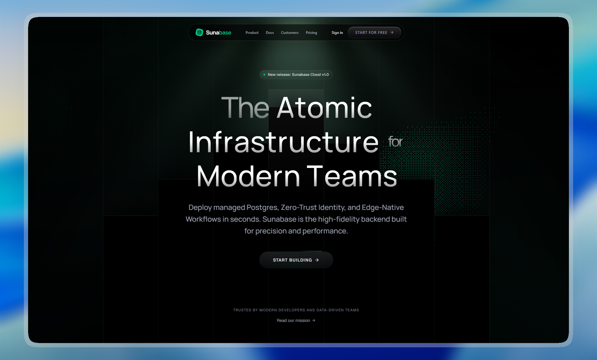

# 🚀 Sunabase Landing Page
> **Day 1/30 of the "Building 1 AI-Generated Landing Page Every Day" Challenge**



## 🚀 About

Conceptual landing page for **Sunabase** a **Supabase alternative**, developed with **Next.js 16** and **Tailwind CSS 4**. This project is the first realization of an ambitious challenge: creating **1 complete and functional mockup per day using AI**. 

Sunabase is designed as a high-performance, modern database infrastructure landing page. The goal is to instantly convey **power**, **speed**, **reliability**, and **enterprise-level security** through a premium, dark-themed aesthetic.

## 🎨 Design & Aesthetic Decisions (The "Why")

For this first day, the chosen theme revolves around **Tech, SQL, Networks, and Data**.

- **Premium "Dark Mode":** The interface relies on a deep black background (`#030303`). It evokes the developer terminal and instantly adds a luxurious, professional aspect.
- **Emerald Accents:** Green is universally recognized as the color of "Operational System," "Success," and "Speed." Paired with black, it offers a vibrant contrast.
- **Glassmorphism:** The use of semi-transparent backgrounds with a `backdrop-blur` effect creates depth (3D) in the interface without overloading it.
- **Micro-interactions:** Instead of a static page, *Framer Motion* is used to bring the interface to life (spinning borders, pulses, dynamic counters). A reactive interface feels like a robust product.

## 🧩 Key Sections

- **🌟 Hero Header:** Designed to grab attention in the first 3 seconds with massive typography, a "Pixel Blast" particle effect (WebGL/Three.js) symbolizing data, and a "Spinning Border Beam" CTA.
- **📱 Mobile Suite (Dynamic Island):** Illustrates that the infrastructure can be managed from a smartphone. Features a custom CSS iPhone 17 Pro Max mockup with a fully interactive **Dynamic Island** that automatically cycles through system states (`SYNCING`, `DEPLOY`, `REC`, `INDEXING`) and fluidly adapts its layout to the text length, mimicking native iOS behavior.
- **🔒 System Pages (404 & Auth):** A mysterious `DarkVeil` background component maintains visual consistency even on error or login pages.
- **🏢 Enterprise Footer:** A strict 12-column grid featuring a massive "Contact Sales" button and a real-time "Systems Operational" indicator with a pulsing green dot to reassure technical users.

## 🛠️ Tech Stack

This mockup was built with cutting-edge technologies from the React ecosystem:

- **[Next.js 16](https://nextjs.org/)** (App Router)
- **[React 19](https://react.dev/)**
- **[Tailwind CSS v4](https://tailwindcss.com/)** for ultra-fast utility styling and modern CSS support.
- **[Motion (Framer Motion)](https://motion.dev/)** for physics-based animations (springs) and layout transitions.
- **Three.js & Postprocessing** for complex visual effects in the Hero section.
- **[Lucide React](https://lucide.dev/)** for clean, consistent iconography.

## 🚀 Quick Start

```bash
# Install dependencies
pnpm install

# Run development server
pnpm dev
```

Open [http://localhost:3000](http://localhost:3000) in your browser to see the result.

## 🌌 Let's meet in space (or on Earth) 🚀

I'm always happy to discuss new projects, collaborations, or simply exchange creative ideas. Here's how to contact me:

- **📧 Email**: [hello@adrielzimbril.com](mailto:hello@adrielzimbril.com)
- **🌐 Website**: [https://www.adrielzimbril.com](https://www.adrielzimbril.com)
- **🐦 Twitter**: [https://twitter.com/adrielzimbril](https://twitter.com/adrielzimbril)
- **💼 LinkedIn**: [https://www.linkedin.com/in/adrielzimbrilcode](https://www.linkedin.com/in/adrielzimbrilcode)
- **🐼 GitHub**: [https://github.com/adrielzimbril](https://github.com/adrielzimbril)

### 🐼 Fun Facts

- 🚀 Passionate about space exploration and technology
- 🐼 Love pandas (and animals in general!)
- 🎨 Creative at heart, whether in design or code
- ☕ Addicted to coffee and complex technical challenges

## 🌟 Join the Adventure

If you like this project, feel free to:

- ⭐ Star the project
- 🐞 Report bugs
- ✨ Suggest improvements
- 🚀 Share with other enthusiasts

## 💖 Support the Project

If you find this project useful and would like to support its development, you can do so through these platforms:

[](https://go.adrielzimbril.com/gs)

## 🌐 Hosting

This project is 100% hosted on modern cloud infrastructure for maximum performance and reliability:

[](https://vercel.com)

## 📄 License

This project is under the MIT license. Feel free to use it as a base for your own portfolio or project.

---

**Developed with ❤️ by Adriel Zimbril**  
_Product Designer & Fullstack Developer_  
🚀 Digital Universe Explorer | 🐼 Panda Friend | 🎨 Passionate Creator
